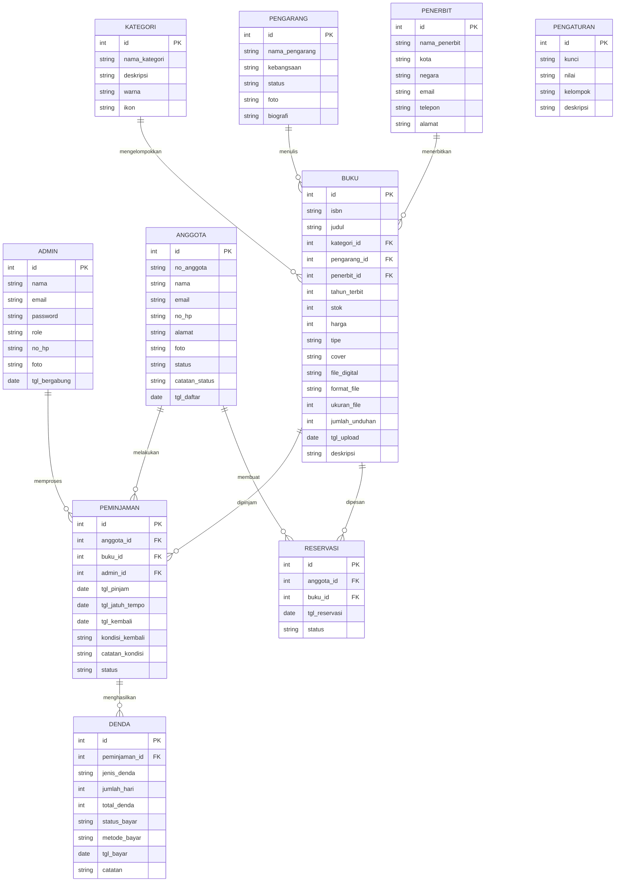
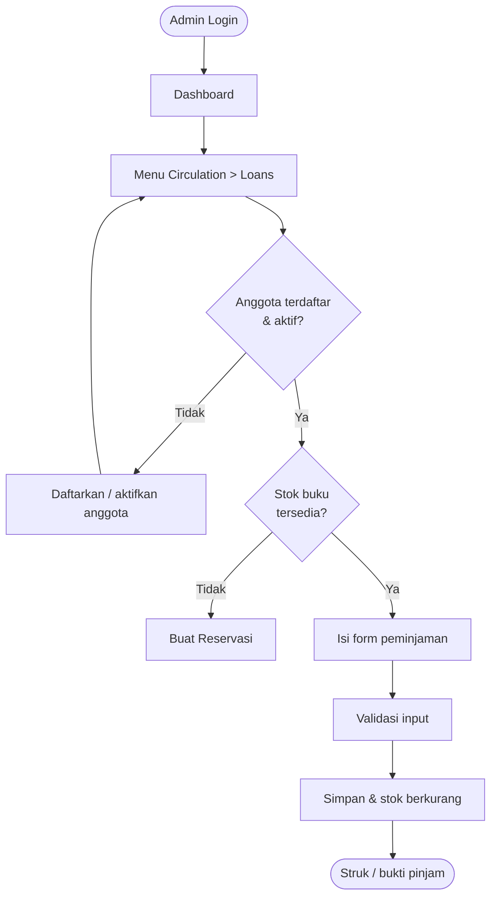
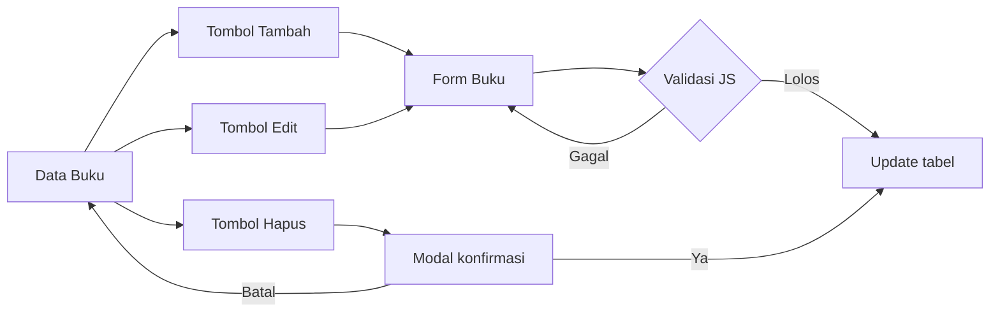
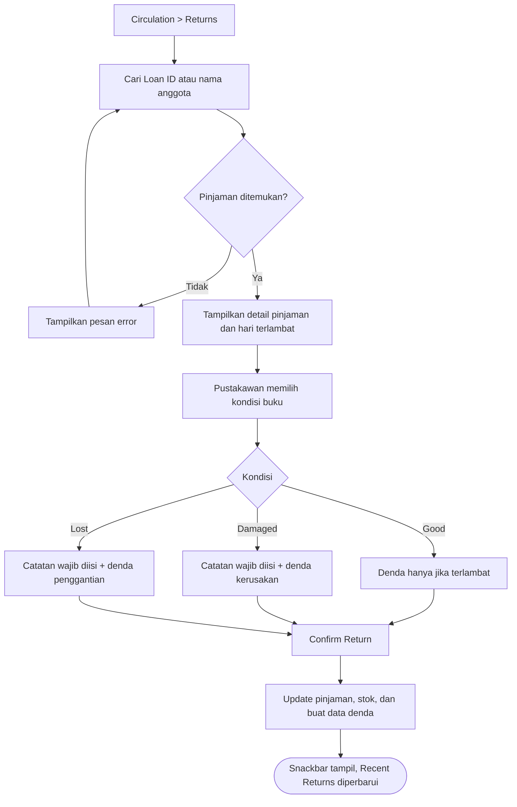
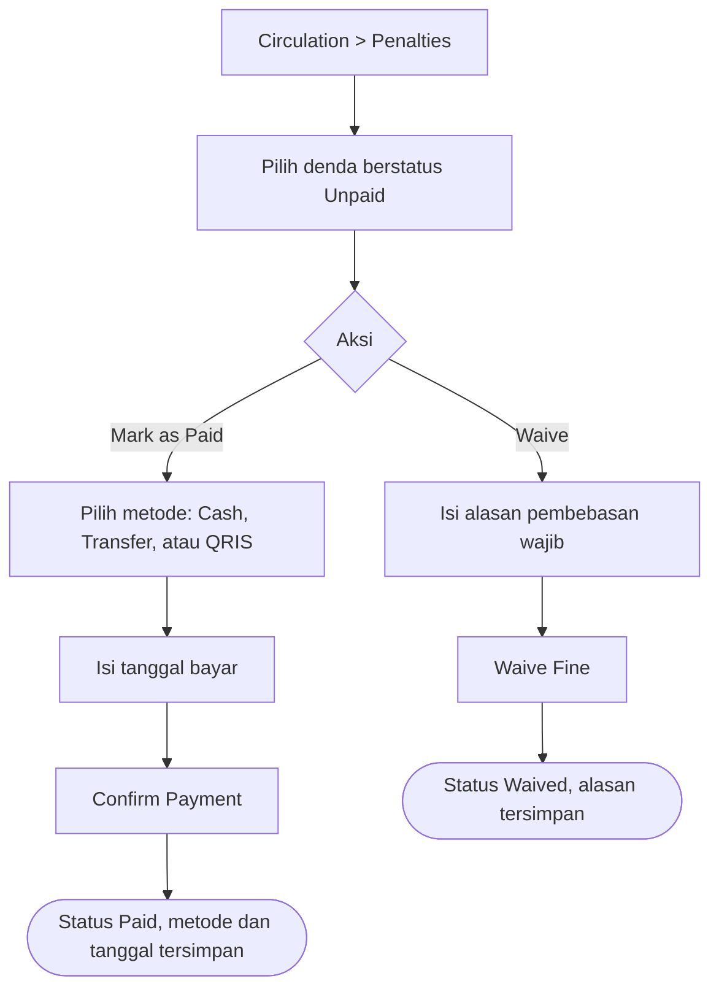

# PERANCANGAN — Admin Panel E-Library (Perpustakaan Digital)

**Mata Kuliah:** Pemrograman Web 2 (Client-Side Programming)
**Tugas:** Tugas ke-1 — Milestone 1
**Nama - NIM:** Gloria Ageng Larasati - 231011401649
**Topik:** Sistem Informasi Perpustakaan Digital (E-Library)
**Tema UI:** Material Design 3
**Bahasa antarmuka:** English (US); dokumen ini memakai bahasa Indonesia

---

## 1. Gambaran Sistem

Admin Panel E-Library digunakan oleh **pustakawan/admin** untuk mengelola koleksi buku (fisik dan digital), data anggota, transaksi peminjaman, pengembalian, denda, serta laporan. Proyek ini murni **client-side** (HTML5, CSS3, JavaScript) dengan *mock data*, tanpa back-end.

**Aktor**
| Aktor | Peran |
|---|---|
| Super Admin | Mengelola seluruh data, pengguna admin, dan pengaturan |
| Pustakawan | Mengelola koleksi, anggota, dan transaksi harian |

---

## 2. Hirarki Menu (Sidebar)

> Label antarmuka memakai bahasa Inggris mengikuti desain. Padanan istilahnya ada di tabel setelah diagram.

```
E-Library Admin (DIGITAL LIBRARY SYSTEM)
├── MAIN MENU
│   └── Dashboard
├── DATA MASTER
│   ├── Data Master (dropdown)
│   │   ├── Books          [badge: jumlah buku]
│   │   ├── Categories
│   │   ├── Authors
│   │   └── Publishers
│   └── Membership         [badge: jumlah anggota]
├── CIRCULATION
│   └── Circulation (dropdown)
│       ├── Loans          [badge: pinjaman aktif]
│       ├── Returns
│       ├── Reservations   [badge: antrean reservasi]
│       └── Penalties
└── LIBRARY
    ├── Digital Collection
    ├── Reports
    └── Settings
```

Bagian bawah sidebar berisi kartu profil admin (avatar, nama, role) dan tombol logout.

| Label di UI | Padanan Indonesia |
|---|---|
| Books / Categories / Authors / Publishers | Data Buku / Kategori / Pengarang / Penerbit |
| Membership | Keanggotaan |
| Loans / Returns / Reservations / Penalties | Peminjaman / Pengembalian / Reservasi / Denda |
| Digital Collection | Koleksi Digital |
| Reports | Laporan |
| Settings | Pengaturan |

**Header (bagian atas):** tombol toggle sidebar, judul dan subjudul halaman, kolom pencarian global (shortcut `Ctrl K`), tanggal dan jam, ikon bantuan, ikon notifikasi dengan badge (buku jatuh tempo), serta profil admin (avatar, nama, role).

### Daftar Halaman

Halaman bertanda **Wajib** memenuhi syarat minimal 4 halaman pada Milestone 3. Halaman lain adalah tambahan jika waktu cukup.

| No | Halaman | File | Prioritas | Isi Utama |
|---|---|---|---|---|
| 1 | Login | `index.html` | Tambahan | Form login admin, tampilkan/sembunyikan password |
| 2 | Dashboard | `pages/dashboard.html` | **Wajib** | 4 kartu ringkasan, line chart peminjaman, donut chart kategori, tabel peminjaman terbaru |
| 3 | Books (Data Master) | `pages/data-master.html` | **Wajib** | Tabel buku, pencarian, filter, tombol Tambah/Edit/Hapus, modal konfirmasi hapus, pagination |
| 4 | Form Buku | `pages/form.html` | **Wajib** | Form tambah/edit buku, validasi JavaScript |
| 5 | Reports | `pages/laporan.html` | **Wajib** | Grafik, filter periode, tabel laporan, tombol cetak dan ekspor |
| 6 | Categories | `pages/categories.html` | Tambahan | Tabel kategori + modal form |
| 7 | Authors | `pages/authors.html` | Tambahan | Tabel pengarang + modal form |
| 8 | Publishers | `pages/publishers.html` | Tambahan | Tabel penerbit + modal form |
| 9 | Loans | `pages/loans.html` | Tambahan | Tab status, tabel pinjaman, modal peminjaman baru |
| 10 | Returns | `pages/returns.html` | Tambahan | Cari pinjaman, catat kondisi buku, hitung denda |
| 11 | Reservations | `pages/reservations.html` | Tambahan | Antrean reservasi, konversi ke pinjaman |
| 12 | Penalties | `pages/penalties.html` | Tambahan | Tabel denda, bayar, bebaskan |
| 13 | Digital Collection | `pages/digital-collection.html` | Tambahan | Tabel e-book, filter format, upload e-book, preview |
| 14 | Settings | `pages/settings.html` | Tambahan | 4 tab: Profile, Library Rules, Notifications, Security |
| 15 | Membership | `pages/membership.html` | Tambahan | Tabel anggota, tab status, panel detail (pinjaman, riwayat, denda), tangguhkan anggota |

Seluruh menu di sidebar sudah memiliki rancangan halaman. Jika waktu terbatas, halaman bertanda Tambahan boleh hanya berupa tautan placeholder di sidebar.

**Catatan form:** Form buku dibuat sebagai **halaman penuh** (`form.html`) sesuai syarat tugas. Form untuk Categories, Authors, dan Publishers berbentuk **modal** karena datanya sedikit.

---

## 3. Rancangan Data (ERD)



> Entitas `PENGATURAN` berdiri sendiri (tanpa relasi) karena menyimpan pasangan kunci dan nilai yang dibaca oleh banyak halaman.

### Kamus Data Entitas Data Master

| Entitas | Atribut | Keterangan |
|---|---|---|
| **BUKU** | `tipe` | `Fisik` atau `Digital` |
| | `cover` | Path/URL gambar sampul |
| | `file_digital` | Path file e-book, hanya terisi jika `tipe = Digital` |
| | `format_file` | `PDF` atau `EPUB`; hanya untuk `tipe = Digital` |
| | `ukuran_file` | Ukuran file dalam KB; hanya untuk `tipe = Digital` |
| | `jumlah_unduhan` | Total unduhan e-book (sumber grafik Digital Downloads di Reports) |
| | `tgl_upload` | Tanggal e-book diunggah |
| | `stok` | Jumlah eksemplar; status ditentukan dari stok (lihat di bawah) |
| | `harga` | Harga buku (Rp); dasar perhitungan denda rusak dan hilang |
| **KATEGORI** | `deskripsi` | Penjelasan singkat kategori (tampil di tabel) |
| | `warna` | Kode HEX aksen kategori (dipakai di tabel dan chart) |
| | `ikon` | Nama Material Icon |
| **PENGARANG** | `kebangsaan` | Contoh: American, British, Israeli |
| | `status` | `Verified` atau `Pending` |
| | `foto` | Path/URL foto profil |
| | `biografi` | Teks bebas |
| **PENERBIT** | `kota`, `negara` | Contoh: Jakarta / ID, New York / US |
| | `email`, `telepon` | Kontak penerbit |
| | `alamat` | Alamat lengkap |

### Kamus Data Entitas Keanggotaan

| Entitas | Atribut | Keterangan |
|---|---|---|
| **ANGGOTA** | `no_anggota` | Dibuat otomatis, contoh: `MBR-0042` (read-only di form) |
| | `alamat` | Alamat lengkap |
| | `foto` | Path/URL foto profil |
| | `status` | `Active`, `Inactive`, atau `Suspended` |
| | `catatan_status` | Alasan penangguhan atau pengaktifan kembali (opsional) |
| | `tgl_daftar` | Tanggal bergabung |

### Kamus Data Entitas Sirkulasi

| Entitas | Atribut | Keterangan |
|---|---|---|
| **PEMINJAMAN** | `status` | `Borrowed`, `Returned`, `Overdue` (Overdue dihitung dari jatuh tempo) |
| | `tgl_kembali` | Terisi saat pustakawan mengonfirmasi pengembalian |
| | `kondisi_kembali` | `Good`, `Damaged`, atau `Lost`; dicatat pustakawan saat pengembalian |
| | `catatan_kondisi` | Catatan bebas, wajib diisi jika kondisi `Damaged` atau `Lost` |
| **RESERVASI** | `status` | `Waiting`, `Ready`, `Expired`, `Cancelled`, `Converted` |
| **DENDA** | `jenis_denda` | `Late` (terlambat), `Damaged` (rusak), atau `Lost` (hilang) |
| | `jumlah_hari` | Hari keterlambatan; hanya relevan untuk jenis `Late` |
| | `status_bayar` | `Unpaid`, `Paid`, atau `Waived` |
| | `metode_bayar` | `Cash`, `Transfer`, atau `QRIS`; terisi saat `Paid` |
| | `tgl_bayar` | Tanggal pembayaran; terisi saat `Paid` |
| | `catatan` | Alasan pembebasan denda jika `Waived` |

> Relasi `PEMINJAMAN` ke `DENDA` adalah satu-ke-banyak, karena satu pengembalian bisa menghasilkan lebih dari satu denda (misalnya terlambat sekaligus rusak).

**Aturan bisnis pengembalian (disimulasikan di JavaScript):**

| Kondisi | Dampak ke stok buku | Denda |
|---|---|---|
| `Good` | Stok bertambah 1 | Hanya denda keterlambatan jika lewat jatuh tempo |
| `Damaged` | Stok tidak bertambah (buku perlu diperbaiki/dicek) | Denda keterlambatan (jika ada) + denda kerusakan |
| `Lost` | Stok tidak bertambah | Denda penggantian buku (+ keterlambatan jika ada) |

**Atribut turunan (dihitung di JavaScript, tidak disimpan):**

| Nilai | Cara menghitung |
|---|---|
| Status buku (`Available` / `Low Stock`) | `Low Stock` jika `stok` ≤ pengaturan `batas_stok_minimum` (default 5), selain itu `Available` |
| Total buku per kategori / pengarang / penerbit | Jumlah baris `BUKU` yang memiliki relasi ke entitas tersebut |
| Persentase kategori | Total buku kategori ÷ total seluruh buku |
| Total e-book | Jumlah baris `BUKU` dengan `tipe = Digital` |
| Total unduhan bulan ini | Jumlah `jumlah_unduhan` pada periode berjalan (disimulasikan dengan mock data) |
| Penyimpanan terpakai | Total `ukuran_file` seluruh e-book |
| Active Loans per anggota | Jumlah `PEMINJAMAN` anggota dengan `status` Borrowed atau Overdue |
| Unpaid Fines per anggota | Jumlah `total_denda` pada `DENDA` anggota dengan `status_bayar = Unpaid` |
| Jumlah anggota per status | Hitung `ANGGOTA` berdasarkan `status` (untuk kartu ringkasan dan tab) |

**Aturan integritas yang disimulasikan di UI:**
- Kategori, pengarang, atau penerbit yang masih punya buku **tidak bisa dihapus** tanpa peringatan (dialog konfirmasi menampilkan pesan peringatan).
- Anggota berstatus **Suspended** tidak muncul di pencarian anggota pada form peminjaman baru, sehingga tidak bisa meminjam.
- Anggota yang masih punya **pinjaman aktif** atau **denda belum lunas** tidak bisa dihapus (tombol Hapus dinonaktifkan dan dialog menampilkan peringatan).
- Menangguhkan atau mengaktifkan kembali anggota meminta alasan (opsional) yang disimpan di `catatan_status`.
- Setelah tambah, ubah, atau hapus data, tampilkan snackbar notifikasi.

### Kamus Data Pengaturan (halaman Settings)

Setiap baris `PENGATURAN` adalah satu pengaturan. Di implementasi, seluruhnya disimpan sebagai satu objek JavaScript (atau `localStorage`) lalu dibaca oleh halaman lain.

| Kelompok | Kunci | Default | Dipakai oleh |
|---|---|---|---|
| Loan Policy | `durasi_pinjam_default` | 7 hari | Loans: jatuh tempo terisi otomatis |
| | `maks_pinjaman_per_anggota` | 3 | Loans: validasi batas pinjaman aktif |
| | `maks_perpanjangan` | 1 kali | Loans: aksi Extend |
| | `lama_perpanjangan` | 7 hari | Loans: aksi Extend |
| Fines | `denda_per_hari` | Rp 1.000 | Returns dan Penalties: denda terlambat |
| | `denda_rusak_persen` | 50% dari `harga` buku | Returns: kondisi Damaged |
| | `denda_hilang_persen` | 100% dari `harga` buku | Returns: kondisi Lost |
| Reservations & Stock | `masa_tahan_reservasi` | 3 hari | Reservations: batas status Ready sebelum Expired |
| | `batas_stok_minimum` | 5 eksemplar | Books: status Low Stock |
| Notifications | `notif_pengingat_jatuh_tempo` | Aktif | Header: ikon notifikasi |
| | `notif_hari_sebelum` | 2 hari | Pengingat jatuh tempo |
| | `notif_terlambat`, `notif_reservasi_siap`, `notif_stok_rendah`, `notif_ringkasan_harian` | Aktif, Aktif, Aktif, Nonaktif | Pengaturan notifikasi |

**Profil dan keamanan:** tab Profile membaca dan mengubah data `ADMIN` (`nama`, `email`, `no_hp`, `foto`). Tab Security (ganti password dan sesi aktif) hanya disimulasikan di UI tanpa penyimpanan nyata.

---

## 4. User Flow

### 4.1 Alur Peminjaman Buku



### 4.2 Alur CRUD Data Buku (halaman penuh)



### 4.3 Alur Pengembalian Buku (dengan Kondisi Buku)



### 4.4 Alur Pembayaran Denda



---

## 5. Design System (Material Design 3)

### 5.1 Palet Warna

> Nilai HEX diambil dari desain referensi dan dapat disesuaikan dengan hasil akhir di Figma.

| Nama Style (Figma) | HEX | Dipakai untuk |
|---|---|---|
| `Primary/Indigo` | `#3F51B5` | Tombol utama, item sidebar aktif, garis chart, logo |
| `Primary/Dark` | `#303F9F` | State hover tombol utama |
| `Primary/Tint` | `#E8EAF6` | Background item aktif, chip kategori, badge |
| `Accent/Amber` | `#FFB300` | Seri kedua pada chart, aksen |
| `Accent/Amber-Tint` | `#FFF8E1` | Chip Low Stock dan Due Soon |
| `Success/Green` | `#2E7D32` | Chip Available, Verified, Paid, Returned |
| `Success/Tint` | `#E8F5E9` | Background chip sukses |
| `Warning/Orange` | `#FB8C00` | Chip Damaged |
| `Warning/Tint` | `#FFF3E0` | Background chip Damaged |
| `Error/Red` | `#B71C1C` | Kartu Overdue, chip Overdue, Unpaid, Lost |
| `Error/Tint` | `#FDECEA` | Background kartu dan chip error |
| `Neutral/Grey` | `#757575` | Chip Expired, Waived, dan Inactive |
| `Neutral/Grey-Tint` | `#EEEEEE` | Background chip netral |
| `Background` | `#F5F5F5` | Background halaman |
| `Surface` | `#FFFFFF` | Card, sidebar, header |
| `Border` | `#E0E0E0` | Garis tabel, border input |
| `Text/Primary` | `#1C1B1F` | Judul dan isi tabel |
| `Text/Secondary` | `#757575` | Subjudul, label kolom, placeholder |

**Warna kategori buku** (ikon kategori, donut chart, avatar):

| Kategori | Warna | HEX |
|---|---|---|
| Fiction | Indigo | `#3F51B5` |
| Science & Tech | Teal | `#009688` |
| History | Amber | `#FFB300` |
| Children | Pink | `#E91E63` |
| Biography | Purple | `#9C27B0` |
| Art & Design | Light Blue | `#03A9F4` |

Avatar penerbit juga memakai Orange `#FF9800` dan Green `#2E7D32`.

**Aturan warna status (sama di semua halaman):**

| Warna | Status |
|---|---|
| Indigo | Borrowed, Waiting |
| Hijau | Available, Verified, Returned, Paid, Ready, Good, Active |
| Amber | Due Soon, Low Stock, Late |
| Oranye | Damaged |
| Merah | Overdue, Unpaid, Lost, Cancelled, Suspended, Needs action |
| Abu-abu | Expired, Waived, Inactive |

### 5.2 Tipografi

Font: **Roboto**.

| Text Style | Ukuran | Weight | Dipakai untuk |
|---|---|---|---|
| `Display/Stat` | 28px | 700 | Angka pada kartu ringkasan |
| `Heading/Page` | 20px | 700 | Judul halaman, judul card |
| `Heading/Section` | 16px | 500 | Subjudul, nama item |
| `Body` | 14px | 400 | Isi tabel, menu, form |
| `Caption` | 12px | 400 | Subjudul, ISBN, tanggal |
| `Overline` | 11px | 700 | Label grup sidebar dan header kolom tabel (huruf kapital) |

### 5.3 Komponen Reusable

Komponen dibuat sebagai **komponen dengan varian** di Figma (komponen polimorfik).

| Komponen | Properti Varian |
|---|---|
| **Button** | `Type` = Filled / Outlined / Icon; `State` = Default / Hover / Disabled; `Icon` = None / Leading |
| **Status Chip** | `Tone` = Success / Warning / Error / Info / Neutral; `Dot` = On / Off |
| **Category Chip** | Background `Primary/Tint`, teks bebas |
| **Count Badge** (sidebar) | `Tone` = Indigo-tint / Green / Amber / Solid-indigo |
| **Sidebar Item** | `Level` = Parent / Child; `State` = Default / Hover / Active; `Badge` = On / Off |
| **Stat Card** | `Tone` = Indigo / Green / Amber / Red-alert (ikon, chip tren, label, progress bar) |
| **Table Row** | `Type` = Book / Author / Loan / Fine; `State` = Default / Hover |
| **Tab Status** | `State` = Default / Active; menampilkan jumlah data |
| **Text Field** (outlined, floating label) | `State` = Default / Focused / Filled / Error / Disabled |
| **Select / Dropdown** | `State` = Default / Open / Error |
| **Radio Card** (kondisi buku) | `Condition` = Good / Damaged / Lost; `Selected` = On / Off |
| **Modal** | `Type` = Form / Confirm-delete / Confirm-action |
| **Category Card** | Ikon berwarna, persentase, progress bar |
| **Snackbar** | `Type` = Success / Error |
| **Pagination** | Info jumlah data, tombol halaman |
| **Header** | Search bar, jam, bantuan, notifikasi, profil |

### 5.4 Layout & Responsivitas

| Elemen | Ukuran |
|---|---|
| Frame desktop | 1440 x 900 |
| Sidebar | 260px (collapsible) |
| Header | sekitar 56px |
| Card | radius 12px, shadow tipis, padding 20-24px |
| Jarak antar card | 16px |
| Lebar maksimal konten | sekitar 1100px, terpusat |

Grid per halaman: Dashboard memakai 4 kartu ringkasan lalu 2 kolom (line chart sekitar 65%, donut sekitar 35%). Halaman kartu (jika ada) memakai grid 3 kolom.

| Breakpoint | Perilaku |
|---|---|
| Desktop (>= 1024px) | Sidebar tetap tampil, konten di samping |
| Tablet (768-1023px) | Sidebar bisa di-collapse jadi ikon |
| Mobile (< 768px) | Sidebar menjadi drawer, tabel scroll horizontal |

---

## 6. Wireframe & Desain

### 6.1 Referensi Desain (AI-generated)

Gambar berikut dibuat dengan Figma Make dan dipakai sebagai **referensi layout awal**. Desain final beserta design system dibuat ulang di Figma (bagian 6.2).

| Halaman | Gambar |
|---|---|
| Login |  |
| Dashboard |  |
| Books |  |
| Form Add Book (modal) |  |
| Categories |  |
| Authors |  |
| Publishers |  |
| Reports |  |
| Loans, Returns, Reservations, Penalties, Digital Collection, Settings, Membership | _(menyusul)_ |

### 6.2 Figma (Design System & High-Fidelity UI)

https://www.figma.com/design/rb4qIuxjCpaJxOA7wNNQYF/E-library-Design?node-id=1-2&t=xHNwYzhXewClBVD8-1


---

## 7. Rencana Teknologi

| Aspek | Pilihan |
|---|---|
| Markup & Style | HTML5 semantik, CSS3 (Flexbox/Grid) atau Tailwind CSS |
| Interaktivitas | JavaScript (DOM, validasi form, modal, toggle sidebar) |
| Grafik | Chart.js |
| Ikon | Material Icons |
| Data | Mock data JSON di JS / Google Spreadsheet |
| Deploy | Vercel atau GitHub Pages |

---

## 8. Struktur Folder

```
├── docs/
│   └── perancangan.md
├── assets/
│   ├── css/
│   ├── js/
│   └── img/
├── pages/
│   ├── dashboard.html
│   ├── data-master.html
│   ├── form.html
│   ├── laporan.html
│   ├── categories.html
│   ├── authors.html
│   ├── publishers.html
│   ├── loans.html
│   ├── returns.html
│   ├── reservations.html
│   ├── penalties.html
│   ├── digital-collection.html
│   ├── settings.html
│   └── membership.html
└── index.html
```
